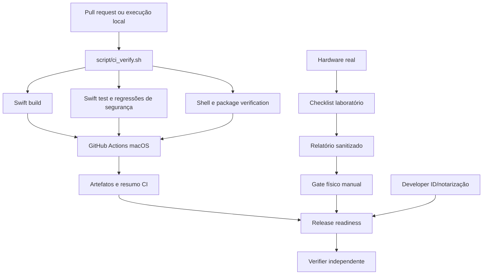

# Tico Release Readiness Design

**Spec**: `.specs/features/release-readiness/spec.md`
**Status**: Draft — decisão recomendada: arquitetura de gates em camadas

## Architecture Overview

A iniciativa será implementada como uma cadeia de evidências. O mesmo gate
local será chamado pelo GitHub Actions; o hardware ficará separado para não
produzir falsos positivos. O release preflight também será separado do build
de desenvolvimento, mantendo o caminho atual como baseline reversível.



## Architecture Options

### Option A — Gate compartilhado + evidência física separada (recommended)

Um script local único executa build/test/package; o workflow chama esse
script; a validação de hardware gera um relatório separado e o Verifier
combina os dois conjuntos de evidências.

- **Vantagens**: reproduzível, baixo acoplamento, não finge hardware em CI,
  preserva o script existente e permite agentes sequenciais.
- **Trade-off**: exige uma etapa manual para declarar suporte físico.

### Option B — Workflow monolítico com script, docs e release juntos

Coloca todos os comandos em um único workflow e usa o GitHub como fonte de
verdade.

- **Vantagens**: visão centralizada no GitHub.
- **Trade-offs**: dificulta executar localmente, mistura ad hoc/notarização e
  torna o hardware ainda mais difícil de representar corretamente.

### Option C — Apenas checklist manual, sem CI novo

Mantém os documentos existentes e adiciona uma sessão humana de release.

- **Vantagens**: menor alteração inicial.
- **Trade-offs**: não impede regressões entre commits, não oferece feedback
  automático e não atende RR-01/RR-02.

**Recomendação**: Option A. Ela maximiza evidência sem alterar o domínio de
gestos e segue as decisões AD-001/AD-002/AD-003.

## Code Reuse Analysis

| Existing component | Location | Reuse |
| --- | --- | --- |
| SwiftPM package and test target | `Package.swift` | Fonte dos comandos de build/test e da matriz unitária. |
| Existing package/build workflow | `script/build_and_run.sh` | Preservar `--package`, staging privado, assinatura ad hoc e verificação do ZIP extraído. |
| Security regression suite | `Tests/TicoTests/SecurityRegressionTests.swift` | Gate obrigatório, sem reabrir os 27 achados já corrigidos. |
| Replay and recognizer tests | `Tests/TicoTests/*Gesture*Tests.swift`, fixtures | Cobertura automatizada de reconhecimento sem hardware. |
| Laboratory and validation UI | `Sources/Tico/Views/TrackpadLaboratoryView.swift`, `TrackpadValidationView.swift` | Fonte do roteiro manual e dos nomes de capacidades. |
| Permission and provider services | `Sources/Tico/Services/PermissionCoordinator.swift`, `MultitouchFrameProvider.swift` | Cenários de TCC, private capture e fallback. |
| Security/distribution docs | `SECURITY.md`, `outputs/*.md` | Atualizar sem contradizer os controles já verificados. |

## Components

### Shared CI gate

- **Purpose**: executar os gates de build, testes, shell e package de forma
  igual no local e no CI.
- **Location**: `script/ci_verify.sh`.
- **Interface**: `./script/ci_verify.sh [--package]`; exit code zero somente
  quando todos os comandos exigidos passam.
- **Dependencies**: Swift 5.10/macOS 26+, `Package.swift`, build script.
- **Reuses**: `swift build`, `swift test`, `build_and_run.sh --package`.

### GitHub workflow

- **Purpose**: executar o gate em pull requests e pushes para `main`.
- **Location**: `.github/workflows/ci.yml`.
- **Interface**: workflow status + summary com test count, command results e
  artifact paths.
- **Dependencies**: macOS runner e checkout do repositório.
- **Reuses**: `script/ci_verify.sh`; não executa hardware e não afirma notarização.

### Public readiness documentation

- **Purpose**: alinhar README, QA, SECURITY, licença, status e limitations.
- **Location**: `README.md`, `outputs/qa-checklist.md`, `SECURITY.md`,
  `LICENSE`, `CONTRIBUTING.md` ou seção equivalente.
- **Interface**: instruções copiáveis e termos de status sem ambiguidade.
- **Dependencies**: comportamento em `Commands.swift` e scripts atuais.
- **Reuses**: documentação de auditoria, hardening e distribuição.

### Hardware evidence pack

- **Purpose**: registrar matriz real sem publicar dados pessoais.
- **Location**: `outputs/hardware-validation/README.md`, template e relatório
  sanitizado.
- **Interface**: cada linha contém `os`, `deviceClass`, `captureMode`,
  `gesture`, `expected`, `observed`, `status`, `notes`.
- **Dependencies**: laboratório, permissões TCC, trackpad físico e fallback.
- **Reuses**: `outputs/qa-checklist.md` e `TrackpadValidationView`.

### Release preflight

- **Purpose**: diferenciar local ad hoc, dry-run e distribuição Developer ID.
- **Location**: `script/release_preflight.sh` ou extensão cirúrgica de
  `script/build_and_run.sh`; `outputs/signing-and-distribution.md`.
- **Interface**: modo sem credenciais nunca retorna “notarized”; modo release
  exige identidade, Hardened Runtime e evidência de notarização.
- **Dependencies**: `codesign`, `spctl`, `notarytool`, `stapler`, artefato ZIP.
- **Reuses**: staging privado e extração em `/private/tmp` já validados.

### Independent Verifier

- **Purpose**: rederivar cobertura, desafiar testes e produzir decisão final.
- **Location**: `.specs/features/release-readiness/validation.md`.
- **Interface**: PASS/FAIL, AC evidence-or-zero, gate output, mutations
  killed/survived, ranked gaps e lesson signals.
- **Dependencies**: `spec.md`, `tasks.md`, diff, testes, `validate.md`.
- **Reuses**: contrato do `tlc-spec-driven`; não altera o working tree real.

## Data Models

### SanitizedHardwareRow

```text
os: String
deviceClass: internal | magic-trackpad | other | unknown
captureMode: advanced-private | public-fallback | unavailable
gesture: String
expected: String
observed: String
status: pass | fail | not-run
notes: String
```

`deviceClass` não inclui serial, nome do computador ou identificador TCC.
`status=not-run` é diferente de `pass` e bloqueia o gate físico quando a linha
é obrigatória.

### ReleaseEvidence

```text
commit: String
version: String
signingMode: ad-hoc | developer-id
notarization: not-attempted | rejected | accepted
stapled: true | false
cleanMachineValidated: true | false
artifactPath: String
```

O modelo é um contrato de documentação; não deve armazenar segredos nem
substituir a validação real de assinatura.

## Error Handling Strategy

| Scenario | Handling | User impact |
| --- | --- | --- |
| Swift build/test fails | CI exits non-zero and keeps logs | PR não pode ser aprovado. |
| Module cache sandbox error local | Documentar `swift test --disable-sandbox` como recuperação local, sem mascarar falha real | O agente repete o gate com evidência. |
| Private framework/TCC unavailable | UI explains capability, fallback remains explicit | Physical PASS is not inferred. |
| Magic Trackpad absent | Mark required row `not-run` | Stable release remains blocked for that coverage claim. |
| Ad hoc identity | Label artifact development-only | No Gatekeeper/notarization claim. |
| Notarization rejected | Stop release and preserve log | No public binary release. |
| Sanitized report contains sensitive data | Reject report before commit | Evidence is corrected, not published. |

## Risks & Concerns

| Concern | Location | Impact | Mitigation |
| --- | --- | --- | --- |
| Private Apple ABI can change | `Sources/Tico/Services/MultitouchFrameProvider.swift` | Advanced gestures can stop working after macOS update. | Keep capability isolation/fallback; require per-OS hardware matrix. |
| Physical test cannot run in ordinary CI | `outputs/qa-checklist.md` | Green CI could be mistaken for hardware support. | Separate RR-07–RR-10 manual gate and CI summary wording. |
| Synced-folder metadata breaks direct signature verification | `script/build_and_run.sh` | False signing failures or corrupted release evidence. | Verify staged and ZIP-extracted app in clean temporary directory. |
| Current docs disagree on laboratory shortcut | `README.md` vs `outputs/qa-checklist.md` | Contributor follows the wrong path. | One task updates docs and tests the documented command. |
| No license in baseline | repository root | Public reuse terms are unclear. | Add chosen license or leave explicit legal blocker; never invent legal approval. |
| Existing test suite may not prove UI outcomes | `Tests/TicoTests` | User-facing regressions can escape unit tests. | Manual UAT for permissions, laboratory, fallback and release workflow. |
| Notarization credentials may be unavailable | `outputs/signing-and-distribution.md` | Cannot honestly finish distribution gate. | Prepare dry-run and mark Developer ID/notarization pending. |

## Tech Decisions

| Decision | Choice | Rationale |
| --- | --- | --- |
| CI source of truth | Shared shell gate called by workflow | Same behavior local/CI and easier agent verification. |
| Hardware evidence format | Sanitized Markdown plus optional summary JSON | Human-readable review with machine-checkable required states. |
| Release boundary | Ad hoc is development; Developer ID/notarization is release | Prevents overclaiming artifact trust. |
| Agent order | Sequential dependency-aligned batches | Prevents docs/CI/release agents from masking failures in the previous layer. |
| Verifier | Fresh agent, author != verifier | Enforces independent evidence and discrimination sensor. |
